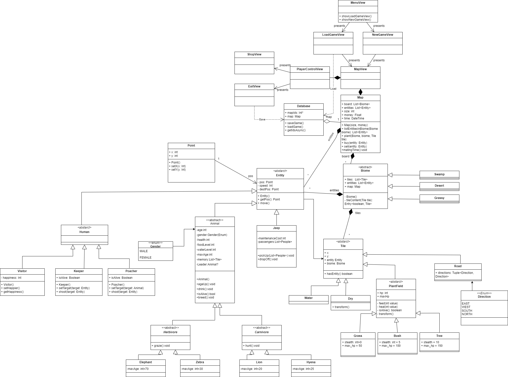

# Plans

Class diagram

<h3>Updated class diagram<h3>

Use-Case diagram

# Requirements

Functional Requirements
 

# Main Menu:
- It should be possible to start a new game.
- It should be possible to exit the application.
- It should be possible to load a saved game.
- It should be possible to set the difficulty level.

# Setup Phase:
- It should be possible to exit the game.
- It should be possible to return to the main menu (with or without saving).
- It should be possible to open the in-game shop.
- It should be possible to place plants and paths.
- It should be possible to buy animals, jeeps and gamekeepers.
- Purchased units can be sold in this phase with a 100% refund (only before starting the game).
- It should be possible to start the simulation.

# Simulation:
- All functions of the setup phase should be available except for starting the game
- After loading the game the selling mechanic has to change to 50% refund
- Game speed has to be adjustable (pause, hours, days, weeks)/second
- When money runs out game ends (defeat)
- After reaching x amount of money game ends (victory)
- When time runs out game ends (defeat)
- User can save the actual state of the game after pressing exit button

# Objects and NPCs

## Animals
### Herbivores
- Herbivores move around the map randomly in groups if they can (max number of herd members is 10).
- When Mating season is called if the group the animal is in meets the parameters new animals of the group's kind are spawned on the map.
- A herd has to move in the general direction the oldest animal is moving to
- When feeding or when they are chased animals move in their own direction and leave the group
- When animal has no group and has an animal of the same species in sight they create a group the older animal dictates the general direction
- Hunger bar has to decrease monotonously after X seconds
- If Hunger bar is not full and plant type tile is in sight for animal it should move directly to the tile and eat until hunger bar is full
- If Hunger Bar reaches zero hp of animal decreases each second
- When damaged by carnivore or poacher hp of animal decreases
- When Carnivore or Poacher is in sight move into opposite direction of carnivore
- When hunger is full and health bar is not health starts to regenerate
- When animal dies it leaves x amount of food value for carnivores to eat
- When animal reaches certain age it dies.

### Carnivores 
- Carnivores move around the map randomly when healthy
- Carnivores move in groups of maximum 5.
- Carnivores move in the same general direction as the group leader (if in group) 
- Hunger bar has to decrease monotonously after X seconds
- If Hunger Bar reaches zero hp of animal decreases each second
- When damaged by poacher hp of animal decreases
- When Herbivore is in sight speed increases by 2 and carnivore starts to chase animal until it is out of sight or is eliminated
- Carnivores eat from the prey they catch.
- When carnivore has food in sight and the prey is not yet damaged the animals priority shifts to eating food
- When hunger is full and health bar is not health starts to regenerate

## Poachers
- Has to spawn randomly on the edges of the map. 
- When an animal is in sight starts to attack it until it eliminates the animal or the animal is out of sight.
- When it is attacked by gamekeepers and health falls below 50% it starts to escape to the edge of the map where it despawns.

## Gamekeepers 
- Wander around the map randomly
- When User clicks on gamekeeper is under Users controll (can be ordered to move to specific location or can be ordered to attack poacher.
- Health of gamekeeper has to regenerate over time when it isn't full.
- When Poacher is in sight auto gamekeeper attacks poacher until it is out of sight or dead.

## Tourists
- Travel in Jeeps on the road path built by the user in jeep
- Happiness rating increases when tourist spots an animal.
- Tourists only travel in Jeeps in designated road. 
- They spawn in numbers equivalent to the popularity of the park that is calculated off of the average happiness of tourists.

## Jeeps
- Jeeps move on the road built.
- Jeeps have to slow down when animal is in sight
- Jeeps have to stop when animal moves across the road infront of them 
- If all Jeeps are used no more tourists can enter the park.

## Plants
- If hp is not full it regenerates gradually
- If herbivore is eating the plant hp decreases.
- If Animal is on plant tile camo of animal increases

Non-Functional Requirements

 

# Product Requirements

## Efficiency

- Minimal load on the processor, memory, and storage.
- Fast response time to all inputs, even on low-end computers.

## Reliability

- No errors occur during the default use of the game.
- The game does not crash unexpectedly.

## Security

- The game does not connect to the internet and does not store personal data, making security concerns irrelevant.

## Portability

- Does require installation.
- Guaranteed compatibility with Windows 8, 10, and 11, Linux, MacOS.

## Usability

- The game interface is intuitive and easy to understand for anyone.
- No external guides or instructions are necessary.
- One user

## Management Requirements

### Environmental

- The game does not integrate with or connect to any external services or softwares.

### Operational

- Usually medium runtime: 1-3 hours.
- Frequent usage.
- Designed for one user, with no specialized knowledge required.

### Development

- Programming language: Java.
- Environment: jre.
- Object-oriented paradigm.
- Clean Code principles.
- Unit Testing.
- Git, GitLab.

## External Requirements

### Legal and Ethical Considerations

- The game's style and content do not harm the university's reputation.

# GUI

Wireframe

UI

</detauls>

# User Stories

All Stories

  
<b>New Game</b>

 

  **As a:** (current) player   
  **I want to:** start a new game 

  |       |                                                           |
  |-------|-----------------------------------------------------------|
  | **Given** | The application is running, and the "New Game" button is visible |
  | **When**  | The "New Game" button is clicked |
  | **Then**  | The difficulty selection window appears|

 

  |       |                                                           |
  |-------|-----------------------------------------------------------|
  | **Given** | The difficulty selection window is visible |
  | **When**  | A difficulty option is selected and the "Start" button is clicked |
  | **Then**  | A newly generated game board appears in its initial state, and the game begins |

 

  
<b>Load Game</b>

 

  **As a:** (current) player   
  **I want to:** load a saved game 

  |       |                                                           |
  |-------|-----------------------------------------------------------|
  | **Given** | The application is running, the "Load Game" button is visible, and there is at least one previously saved game stored in the memory |
  | **When**  | The "Load Game" button is clicked |
  | **Then**  | A new window appears with a list of previously saved games |

  |       |                                                           |
  |-------|-----------------------------------------------------------|
  | **Given** | The window with the list of previously saved games is active |
  | **When**  | The selected map is clicked |
  | **Then**  | The previously saved game state and map are loaded, and the game resumes from where it was left off |

 

  
<b>Exit Game</b>

 

  **As a:** (current) player  
  **I want to:** exit the game  

  |       |                                                           |
  |-------|-----------------------------------------------------------|
  | **Given** | The game is running |
  | **When**  | The "Exit" button is clicked |
  | **Then**  | A confirmation dialog appears with the choices of "Save" or "Exit" |

 

  |       |                                                           |
  |-------|-----------------------------------------------------------|
  | **Given** | The confirmation dialog about exiting the game is active |
  | **When**  | The "Exit" button is clicked |
  | **Then**  | The game closes |

 

  
<b>Save Game</b>

 

  **As a:** (current) player  
  **I want to:** save the game  

  |       |                                                           |
  |-------|-----------------------------------------------------------|
  | **Given** | The game is running |
  | **When**  | The "Exit" button is clicked |
  | **Then**  | A confirmation dialog appears with the choices of "Save" or "Exit"  |

 

  |       |                                                           |
  |-------|-----------------------------------------------------------|
  | **Given** | The confirmation dialog about exiting the game is active |
  | **When**  | The "Save" button is clicked |
  | **Then**  | The game closes |

 

  
<b>Pause Game</b>

 

  **As a:** (current) player   
  **I want to:** pause the game

  |       |                                                           |
  |-------|-----------------------------------------------------------|
  | **Given** | The game is running |
  | **When**  | The "Pause" button is clicked |
  | **Then**  | The game pauses (the timer and the entities stop) |

 

  
<b>Resume Game</b>

 

  **As a:** (current) player   
  **I want to:** resume the game

  |       |                                                           |
  |-------|-----------------------------------------------------------|
  | **Given** | The game is paused |
  | **When**  | The "Resume" button is clicked |
  | **Then**  | The game resumes (the timer and the entities continue) |

 

  
<b>Change Speed</b>

 

  **As a:** (current) player   
  **I want to:** change the speed of the game

  |       |                                                           |
  |-------|-----------------------------------------------------------|
  | **Given** | The game is running |
  | **When**  | The "Change Speed" button is clicked |
  | **Then**  | The speed of the game changes (slow -> medium -> fast -> slow -> ...) |

 

  
<b>Open Shop</b>

 

  **As a:** (current) player   
  **I want to:** open the shop

  |       |                                                           |
  |-------|-----------------------------------------------------------|
  | **Given** | The game is running and the Shop window is closed |
  | **When**  | The "Shop" button is clicked |
  | **Then**  | The Shop window appears |

 

  
<b>Close Shop</b>

 

  **As a:** (current) player   
  **I want to:** close the shop

  |       |                                                           |
  |-------|-----------------------------------------------------------|
  | **Given** | The game is running and the Shop window is open |
  | **When**  | The "Close Shop" button is clicked |
  | **Then**  | The Shop window closes |

 

  
<b>Buy (and) Place Plant</b>

 

  **As a:** (current) player   
  **I want to:** buy and place a plant

  |       |                                                           |
  |-------|-----------------------------------------------------------|
  | **Given** | The Shop window is open |
  | **When**  | The choosen plant is clicked, and we have the right amount of money to buy the selected plant |
  | **Then**  | The plant is selected and Shop window closes|

  |       |                                                           |
  |-------|-----------------------------------------------------------|
  | **Given** | The Shop window is closed and a plant is selected |
  | **When**  | A valid tile is clicked (invalid tiles: rock, water, road, plants) |
  | **Then**  | The plant is placed on the selected tile (the price of the plant is deducted from the money)|

 

  
<b>Buy (and) Place Animal</b>

 

  **As a:** (current) player   
  **I want to:** buy and place a plant

  |       |                                                           |
  |-------|-----------------------------------------------------------|
  | **Given** | The Shop window is open |
  | **When**  | The choosen animal is clicked, and we have the right amount of money to buy the selected animal |
  | **Then**  | The animal is selected and Shop window closes|

  |       |                                                           |
  |-------|-----------------------------------------------------------|
  | **Given** | The Shop window is closed and a animal is selected |
  | **When**  | A valid tile is clicked (invalid tiles: rock, water) |
  | **Then**  | The animal is placed on the selected tile (the price of the animal is deducted from the money)|

 

  
<b>Buy (and) Place Keeper</b>

 

  **As a:** (current) player   
  **I want to:** buy and place a plant

  |       |                                                           |
  |-------|-----------------------------------------------------------|
  | **Given** | The Shop window is open |
  | **When**  | The "Keeper" icon is clicked, and we have the right amount of money to buy the keeper |
  | **Then**  | The keeper is selected and Shop window closes|

  |       |                                                           |
  |-------|-----------------------------------------------------------|
  | **Given** | The Shop window is closed and the keeper is selected |
  | **When**  | A valid tile is clicked (invalid tiles: rock, water) |
  | **Then**  | The keeper is placed on the selected tile (the price of the keeper is deducted from the money)|

 

  
<b>Buy Jeep</b>

 

  **As a:** (current) player   
  **I want to:** buy and place a jeep

  |       |                                                           |
  |-------|-----------------------------------------------------------|
  | **Given** | The Shop window is open |
  | **When**  | The Jeep icon is clicked, and we have the right amount of money to buy the jeep |
  | **Then**  | The Jeep is added to the vehicles (the price is deducted from the money) |

  

  
<b>Buy (and) Place Road</b>

 

  **As a:** (current) player   
  **I want to:** buy and place a road

  |       |                                                           |
  |-------|-----------------------------------------------------------|
  | **Given** | The Shop window is open |
  | **When**  | The Road icon is clicked, and we have the right amount of money to buy the road |
  | **Then**  | The Road is selected and the Shop window closes |

  |       |                                                           |
  |-------|-----------------------------------------------------------|
  | **Given** | The Shop window is closed and the road is selected |
  | **When**  | A valid tile is clicked (invalid tiles: rock, water, road) |
  | **Then**  | The road is placed on the selected tile (the price of the road is deducted from the money)

 

  
<b>Sell an Entity</b>

 

  **As a:** (current) player   
  **I want to:** sell an entity (animals, plants, roads, jeeps, lakes, keepers)

  |       |                                                           |
  |-------|-----------------------------------------------------------|
  | **Given** | The game is running and the "Start Selling" button is visible |
  | **When**  | The "Start Selling" button is clicked and then the selected entity is clicked on the map |
  | **Then**  | The clicked entity is sold and is removed from the map, the price of the sold entity gets added to the money |

 

  
<b>Turn off selling mode</b>

 

  **As a:** (current) player   
  **I want to:** turn off selling mode

  |       |                                                           |
  |-------|-----------------------------------------------------------|
  | **Given** | The game is running, the selling mode is on and the "Stop Selling" button is visible |
  | **When**  | The "Stop Selling" button is clicked |
  | **Then**  | The selling mode is turned off |

 

# Feasibility plans

  

## Human Resources  
- Three designers/developers/testers  

## Hardware Resources  
- Three development computers (medium hardware requirements)  

## Software Resources  
- Development environment: InetelliJ IDEA, jrl
- Engine: libgdx
- Version control: Git  
- Project management platform: GitLab  

## Operations  
- No operational support required  

## Maintenance  
- No maintenance required beyond potential bug fixes  

## Implementation  
- Duration:  
- Cost: 

